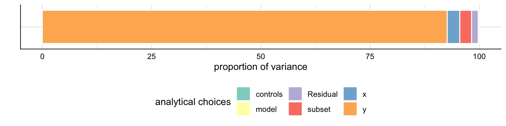

<!-- README.md is generated from README.Rmd. Please edit that file -->

<div style="padding-top:1em; padding-bottom: 0.5em;">


</div>

# specr

<!-- badges: start -->

[](https://www.tidyverse.org/lifecycle/#experimental)
[](https://CRAN.R-project.org/package=specr)
<!-- badges: end -->

The goal of specr is to facilitate specification curve analyses as
described by Simonson, Simmons & Nelson (2019). It provides functions to
setup, run, and plot all specifications.

**Disclaimer:** Running a specification curve analysis does not make
your findings any more reliable, valid or generalizable than a single
analyis. The method is meant to inform about the effects of analytical
choices on results, and not a better way to estimate a correlation or
effect.

## Installation

You can install the development version from
[GitHub](https://github.com/) with:

``` r
# install.packages("devtools")
devtools::install_github("masurp/specr")
```

## Example

This is a basic example of how to use the major functions in this
package. In a first step, check the data (here a simulated data set).

``` r
# Load library
library(specr)
head(example_data)
#>         x1         x2         c1        c2        y1         y2 group1
#> 1 1.533913  1.3697122  0.5424902 3.8924435 23.500543 10.4269278      0
#> 2 1.680639  1.5163745 -1.2415868 3.3377268 17.017955  0.5733467      1
#> 3 1.223941 -0.2381044  0.1405891 0.8911959 -3.678272  4.2303190      0
#> 4 1.765276  0.9524049  4.0397943 1.8567454 21.668684 14.8865252      1
#> 5 1.907134  0.6282816  3.1002518 5.5840574 32.713106 20.5251920      0
#> 6 1.710695  1.1898467  0.4648824 4.0239483 20.422171  4.3471236      1
#>   group2
#> 1      A
#> 2      C
#> 3      B
#> 4      B
#> 5      A
#> 6      C
```

In a second step, we only need to use the function `run_specs()` and
include our analytical choices as arguments. The resulting data frame
includes relevant statistics of all models that were estimated.

``` r
# Self-made functions can be used too
lm_gauss <- function(formula, data) {
  glm(formula = formula, data = data, family = gaussian(link = "identity"))
}

# Run specification curve analysis
results <- run_specs(df = example_data, 
                     y = c("y1", "y2"), 
                     x = c("x1", "x2"), 
                     model = c("lm", "lm_gauss"), 
                     controls = c("c1", "c2"), 
                     subsets = list(group1 = unique(example_data$group1),
                                   group2 = unique(example_data$group2)))
# Check results
results
#> # A tibble: 384 x 10
#>    x     y     model controls estimate std.error statistic  p.value   obs
#>    <chr> <chr> <chr> <chr>       <dbl>     <dbl>     <dbl>    <dbl> <int>
#>  1 x1    y1    lm    c1 + c2     4.95      0.525     9.43  3.11e-18   250
#>  2 x2    y1    lm    c1 + c2     6.83      0.321    21.3   1.20e-57   250
#>  3 x1    y2    lm    c1 + c2    -0.227     0.373    -0.607 5.44e- 1   250
#>  4 x2    y2    lm    c1 + c2     0.985     0.324     3.04  2.62e- 3   250
#>  5 x1    y1    lm_g… c1 + c2     4.95      0.525     9.43  3.11e-18   250
#>  6 x2    y1    lm_g… c1 + c2     6.83      0.321    21.3   1.20e-57   250
#>  7 x1    y2    lm_g… c1 + c2    -0.227     0.373    -0.607 5.44e- 1   250
#>  8 x2    y2    lm_g… c1 + c2     0.985     0.324     3.04  2.62e- 3   250
#>  9 x1    y1    lm    c1          5.53      0.794     6.97  2.95e-11   250
#> 10 x2    y1    lm    c1          8.07      0.557    14.5   6.90e-35   250
#> # … with 374 more rows, and 1 more variable: subsets <chr>
```

In a final step, we can use the function `plot_specs()` to produce a
typical visualization of the specification curve and how the analytical
choices affected the obtained results.

``` r
# Plot specification curve analysis
plot_specs(results)
```


Furthermore, we can estimate how much variance in the specification
curve is related to which analytical decisions. Therefore, we can use
the function `variance_specs()` to calculate a respective table or
`plot_variance()`to visualize the distribution.

``` r
# Decompose variance of the specification curve
variance_specs(results)
#>        grp        vcov         icc    percent
#> 1  subsets  0.79493804 0.036267265  3.6267265
#> 2 controls  0.04969939 0.002267423  0.2267423
#> 3    model  0.00000000 0.000000000  0.0000000
#> 4        y 19.68136056 0.897917924 89.7917924
#> 5        x  0.43038432 0.019635319  1.9635319
#> 6 Residual  0.96250363 0.043912069  4.3912069

# Plot decomposition
plot_variance(results)
```



## How to cite this package

Developing and maintaining open source software is an important yet
often underappreciated contribution to scientific progress. Thus,
whenever you are using open source software (or software in general),
please make sure to cite it appropriately so that developers get credit
for their work.

When using `specr`, please cite it as follows:

``` r
citation("specr")
#> 
#> To cite parameters in publications use:
#> 
#>   Masur, Philipp K. & Scharkow, M. (2019). specr: Statistical
#>   functions for conducting specification curve analyses. Available
#>   from https://github.com/masurp/specr.
#> 
#> A BibTeX entry for LaTeX users is
#> 
#>   @Misc{,
#>     title = {specr: Statistical functions for conducting specification curve analyses (Version 0.1.0)},
#>     author = {Philipp K. Masur and Michael Scharkow},
#>     year = {2019},
#>     url = {https://github.com/masurp/specr},
#>   }
```

## References

Simonsohn, U., Simmons, J. P., & Nelson, L. D. (2019). Specification
Curve: Descriptive and Inferential Statistics for all Plausible
Specifications Available at:
<http://urisohn.com/sohn_files/wp/wordpress/wp-content/uploads/Paper-Specification-curve-2019-11-16.pdf>
