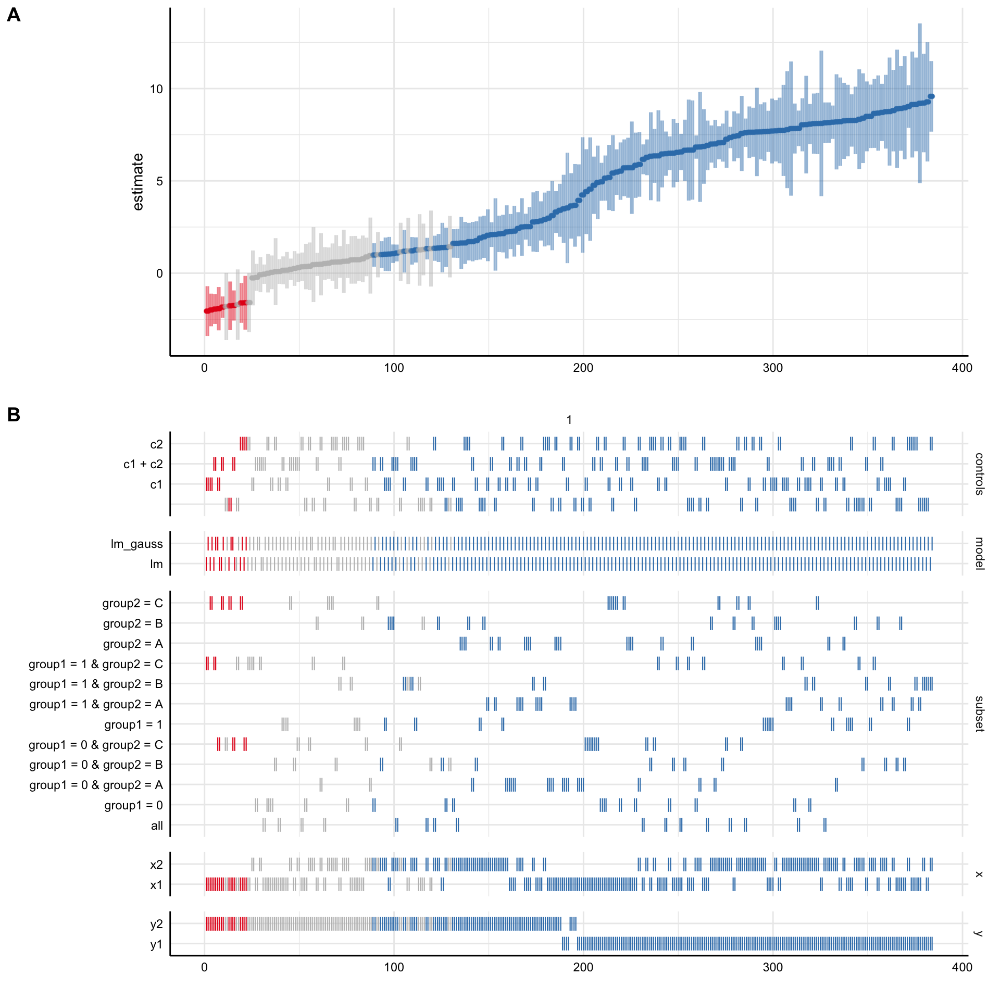

<!-- README.md is generated from README.Rmd. Please edit that file -->

# specr

<!-- badges: start -->

[](https://www.tidyverse.org/lifecycle/#experimental)
[](https://CRAN.R-project.org/package=specr)
<!-- badges: end -->

The goal of specr is to facilitate specification curve analyses as
described by Simonson, Simmons & Nelson (2015).\[1\] It provides
functions to setup, run, and plot all specifications.

## Installation

You can install the development version from
[GitHub](https://github.com/) with:

``` r
# install.packages("devtools")
devtools::install_github("masurp/specr")
```

## Example

This is a basic example of how to use the major functions in this
package. In a first step, we simulate some data that we can run a
specification curve analysis with.

``` r
# Load library
library(specr)

# Simulating some data
x1 <- rnorm(500, 2.5, 1)
x2 <- 2*x1 + rnorm(500, 0, 1)
c1 <- rnorm(500, 2.5, 2)
c2 <- rnorm(500, 2.5, 2)
gender <- rep(c(0,1), 250)
y1 <- 2*x1 + 2.5*x2 + 2*c1 + 2*c2 + 0.5*(x1*c1) + 0.25*(x2*c2) + 2*gender + rnorm(500, 0, 1)
y2 <- 2*x1 + 2.5*x2 + 2*c1 + 2*c2 + 0.5*(x1*c1) + 0.25*(x2*c2) + 2*gender + rnorm(500, 0, 1)
d <- data.frame(x1, x2, c1, c2, gender, y1, y2)

# Check data
head(d)
#>         x1       x2       c1         c2 gender       y1       y2
#> 1 2.651347 5.551732 4.586782  0.8926008      0 37.49179 37.49800
#> 2 3.682208 7.662658 1.658685 -1.9727400      1 27.29487 25.92298
#> 3 3.321175 6.455129 2.664986 -1.7209318      0 26.25652 27.62138
#> 4 4.891453 8.896054 1.475284 -0.5069221      1 37.18363 36.54832
#> 5 3.144061 7.017656 3.734942  3.3965117      0 48.41670 49.17358
#> 6 2.903576 4.735994 2.969299  4.9735140      1 43.02540 44.99472
```

In a second step, we only need to use the function `run_specs()` and
include our analytical choices as arguments. The resulting data frame
includes relevant statistics of all models that were estimated.

``` r
# Run specification curve analysis
results <- run_specs(df = d, 
                  y = c("y1", "y2"), 
                  x = c("x1", "x2"), 
                  model = "glm", 
                  controls = c("c1", "c2"), 
                  subset = list(gender = unique(d$gender)))
# Check results
head(results)
#> # A tibble: 6 x 9
#>   x     y     model controls estimate std.error statistic   p.value subset 
#>   <chr> <chr> <chr> <chr>       <dbl>     <dbl>     <dbl>     <dbl> <chr>  
#> 1 x1    y1    glm   c1 + c2      9.35    0.201       46.4 1.05e-123 gender…
#> 2 x2    y1    glm   c1 + c2      4.40    0.0639      68.9 9.18e-163 gender…
#> 3 x1    y2    glm   c1 + c2      9.43    0.195       48.3 1.61e-127 gender…
#> 4 x2    y2    glm   c1 + c2      4.42    0.0642      68.9 8.38e-163 gender…
#> 5 x1    y1    glm   c1           9.30    0.452       20.5 2.20e- 55 gender…
#> 6 x2    y1    glm   c1           4.43    0.191       23.2 4.57e- 64 gender…
```

In a final step, we can use the function `plot_specs()` to produce a
typical visualization of the specification curve and how the analytical
choices affected the obtained results.

``` r

# Plot specification curve analysis
plot_specs(results)
```



## References

1.  <http://sticerd.lse.ac.uk/seminarpapers/psyc16022016.pdf>
