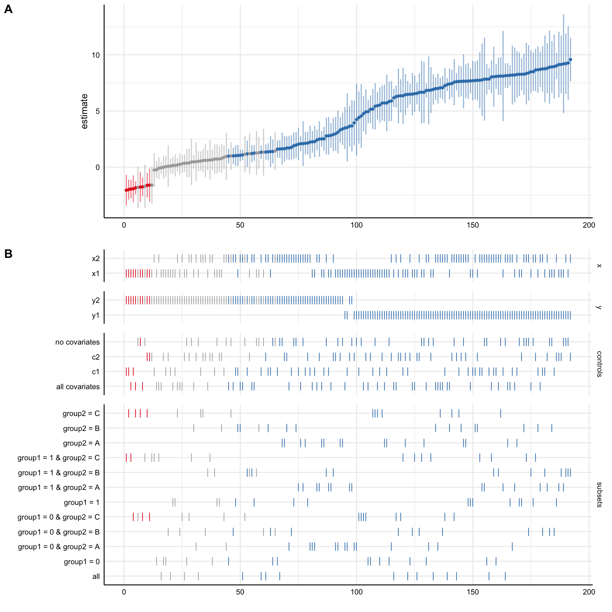

<!-- README.md is generated from README.Rmd. Please edit that file -->

<div style="padding-top:1em; padding-bottom: 0.5em;">


</div>

# specr - Statistical Functions for Specification Curve Analyses

<!-- badges: start -->

[](https://www.tidyverse.org/lifecycle/#experimental)
[](https://CRAN.R-project.org/package=specr)
<!-- badges: end -->

## Overview

The goal of specr is to facilitate specification curve analyses
(Simonsohn, Simmons & Nelson, 2019; also known as multiverse analyses,
see Steegen, Tuerlinckx, Gelman & Vanpaemel, 2016). It can be used to
investigate how different (theoretically plausible) analytical choices
affect outcome statistics within the universe of one single data set.

It provides functions to setup, run, evaluate, and plot the multiverse
of specifications. A simple usage example is provided below. For more
information about the various functions and specific use cases, visit
the [documentation](https://masurp.github.io/specr/index.html).

There are also some vignettes that exemplify and explain specific
aspects and functions of the package:

  - [Getting
    started](https://masurp.github.io/specr/articles/specr.html): A
    comprehensive example. This vignette illustrates the major functions
    of the package.
  - [Customizing specification curve
    plots](https://masurp.github.io/specr/articles/custom-plot.html):
    This vignette exemplifies various ways to plot the specification
    curve.
  - [Decomposing the variance of the specification
    curve](https://masurp.github.io/specr/articles/decompose_var.html):
    An example of how to investigate variance components of the
    specification curve.
  - [Visualizing progress during
    estimation](https://masurp.github.io/specr/articles/progress.html):
    This vignette explains how to create a progress bar for longer
    computations.

## Disclaimer

We do see a lot of value in investigating how analytical choices affect
a statistical outcome of interest. However, we strongly caution against
using `specr` as a tool to somehow arrive at a better estimate. Running
a specification curve analysis does not make your findings any more
reliable, valid or generalizable than a single analysis. The method is
only meant to inform about the effects of analytical choices on results,
and not a better way to estimate a correlation or effect.

## Installation

You can install the development version from
[GitHub](https://github.com/) with:

``` r
# install.packages("devtools")
devtools::install_github("masurp/specr")
```

## Simple example

Using `specr` is comparatively simple. The main function is
`run_specs()` in which analytical choices are specified as arguments.
The function `plot_specs()` can then be used to visualize the results.

``` r
library(specr)

# Run specs
results <- run_specs(df = example_data, 
                     y = c("y1", "y2"), 
                     x = c("x1", "x2"), 
                     model = c("lm"), 
                     controls = c("c1", "c2"), 
                     subsets = list(group1 = unique(example_data$group1),
                                    group2 = unique(example_data$group2)))
# Result frame
head(results)
#> # A tibble: 6 x 12
#>   x     y     model controls estimate std.error statistic  p.value conf.low
#>   <chr> <chr> <chr> <chr>       <dbl>     <dbl>     <dbl>    <dbl>    <dbl>
#> 1 x1    y1    lm    c1 + c2     4.95      0.525     9.43  3.11e-18    3.92 
#> 2 x2    y1    lm    c1 + c2     6.83      0.321    21.3   1.20e-57    6.20 
#> 3 x1    y2    lm    c1 + c2    -0.227     0.373    -0.607 5.44e- 1   -0.961
#> 4 x2    y2    lm    c1 + c2     0.985     0.324     3.04  2.62e- 3    0.347
#> 5 x1    y1    lm    c1          5.53      0.794     6.97  2.95e-11    3.96 
#> 6 x2    y1    lm    c1          8.07      0.557    14.5   6.90e-35    6.98 
#> # … with 3 more variables: conf.high <dbl>, obs <int>, subsets <chr>

# Plot
plot_specs(results, choices = c("x", "y", "controls", "subsets"))
```



## How to cite this package

``` r
citation("specr")
#> 
#> To cite 'specr' in publications use:
#> 
#>   Masur, Philipp K. & Scharkow, M. (2019). specr: Statistical functions
#>   for conducting specification curve analyses. Available from
#>   https://github.com/masurp/specr.
#> 
#> A BibTeX entry for LaTeX users is
#> 
#>   @Misc{,
#>     title = {specr: Statistical functions for conducting specification curve analyses (Version 0.2.0)},
#>     author = {Philipp K. Masur and Michael Scharkow},
#>     year = {2019},
#>     url = {https://github.com/masurp/specr},
#>   }
```

## References

Simonsohn, U., Simmons, J. P., & Nelson, L. D. (2019). *Specification
Curve: Descriptive and Inferential Statistics for all Plausible
Specifications.* Available at: <https://doi.org/10.2139/ssrn.2694998>

Steegen, S., Tuerlinckx, F., Gelman, A., & Vanpaemel, W. (2016).
Increasing Transparency Through a Multiverse Analysis. *Perspectives on
Psychological Science*, 11(5), 702-712.
<https://doi.org/10.1177/1745691616658637>
