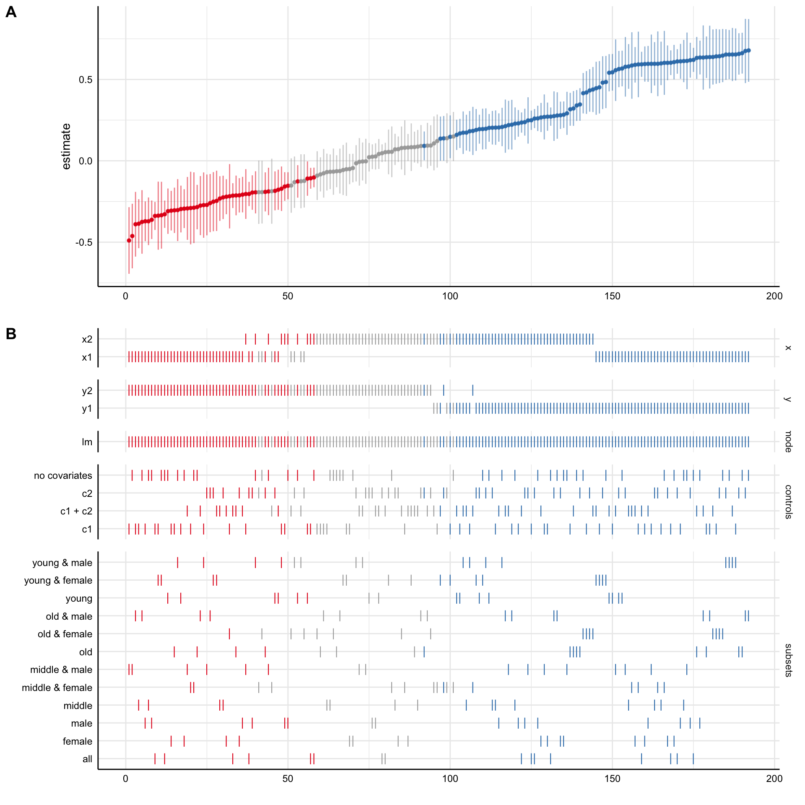

<!-- README.md is generated from README.Rmd. Please edit that file -->

<div style="padding-top:1em; padding-bottom: 0.5em;">


</div>

# specr

<!-- badges: start -->

[](https://CRAN.R-project.org/package=specr)
[](https://travis-ci.org/masurp/specr)
 [](https://www.tidyverse.org/lifecycle/#maturing)
<!-- badges: end -->

### Conducting and Visualizing Specification Curve Analyses

The goal of specr is to facilitate specification curve analyses
(Simonsohn, Simmons & Nelson, 2019; also known as multiverse analyses,
see Steegen, Tuerlinckx, Gelman & Vanpaemel, 2016). It can be used to
investigate how different (theoretically plausible) analytical choices
affect outcome statistics within the universe of one single data set.

It provides functions to setup, run, evaluate, and plot the multiverse
of specifications. A simple usage example is provided below. For more
information about the various functions and specific use cases, visit
the [documentation](https://masurp.github.io/specr/index.html).

There are also some vignettes that exemplify and explain specific
aspects and functions of the package:

-   [Getting
    started](https://masurp.github.io/specr/articles/specr.html): A
    comprehensive example. This vignette illustrates the major functions
    of the package.
-   [Customizing specification curve
    plots](https://masurp.github.io/specr/articles/custom-plot.html):
    This vignette exemplifies various ways to plot the specification
    curve.
-   [Decomposing the variance of the specification
    curve](https://masurp.github.io/specr/articles/decompose_var.html):
    Investigating variance components of the specification curve.
-   [Including latent measurement
    models](https://masurp.github.io/specr/articles/measurement_models.html):
    This vignette exemplifies how to include latent measurement models
    and estimate structural equations models using `lavaan`.
-   [Including random effects/Estimate multilevel
    models](https://masurp.github.io/specr/articles/random_effects.html):
    This vignette exemplifies how to include random effects and estimate
    multilevel models using `lme4`.
-   [Visualizing progress during
    estimation](https://masurp.github.io/specr/articles/progress.html):
    This vignette explains how to create a progress bar for longer
    computations.

### Disclaimer

We do see a lot of value in investigating how analytical choices affect
a statistical outcome of interest. However, we strongly caution against
using `specr` as a tool to somehow arrive at a better estimate. Running
a specification curve analysis does not make your findings any more
reliable, valid or generalizable than a single analysis. The method is
only meant to inform about the effects of analytical choices on results,
and not a better way to estimate a correlation or effect.

### Installation

Install specr from CRAN:

``` r
install.packages("specr")
```

Or install the most recent development version from
[GitHub](https://github.com/) with:

``` r
# install.packages("devtools")
devtools::install_github("masurp/specr")
```

### Usage

Using `specr` is comparatively simple. The main function is
`run_specs()` in which analytical choices are specified as arguments.
The function `plot_specs()` can then be used to visualize the results.

``` r
# Load package
library(specr)

# Run specs
results <- run_specs(df = example_data, 
                     y = c("y1", "y2"), 
                     x = c("x1", "x2"), 
                     model = c("lm"), 
                     controls = c("c1", "c2"), 
                     subsets = list(group1 = unique(example_data$group1),
                                    group2 = unique(example_data$group2)))
# Result frame
head(results)
#> # A tibble: 6 × 12
#>   x     y     model controls estimate std.error statistic  p.value conf.low
#>   <chr> <chr> <chr> <chr>       <dbl>     <dbl>     <dbl>    <dbl>    <dbl>
#> 1 x1    y1    lm    c1 + c2     4.95      0.525     9.43  3.11e-18    3.92 
#> 2 x2    y1    lm    c1 + c2     6.83      0.321    21.3   1.20e-57    6.20 
#> 3 x1    y2    lm    c1 + c2    -0.227     0.373    -0.607 5.44e- 1   -0.961
#> 4 x2    y2    lm    c1 + c2     0.985     0.324     3.04  2.62e- 3    0.347
#> 5 x1    y1    lm    c1          5.53      0.794     6.97  2.95e-11    3.96 
#> 6 x2    y1    lm    c1          8.07      0.557    14.5   6.90e-35    6.98 
#> # … with 3 more variables: conf.high <dbl>, obs <int>, subsets <chr>

# Plot
plot_specs(results, choices = c("x", "y", "controls", "subsets"))
```



### How to cite this package

``` r
citation("specr")
#> 
#> To cite 'specr' in publications use:
#> 
#>   Masur, Philipp K. & Scharkow, M. (2019). specr: Statistical functions
#>   for conducting specification curve analyses. Available from
#>   https://github.com/masurp/specr.
#> 
#> A BibTeX entry for LaTeX users is
#> 
#>   @Misc{,
#>     title = {specr: Statistical functions for conducting specification curve analyses (Version 0.2.1)},
#>     author = {Philipp K. Masur and Michael Scharkow},
#>     year = {2019},
#>     url = {https://github.com/masurp/specr},
#>   }
```

### References

-   Simonsohn, U., Simmons, J.P. & Nelson, L.D. (2020). Specification
    curve analysis. *Nature Human Behaviour, 4*, 1208–1214.
    <https://doi.org/10.1038/s41562-020-0912-z>

-   Steegen, S., Tuerlinckx, F., Gelman, A., & Vanpaemel, W. (2016).
    Increasing Transparency Through a Multiverse Analysis. *Perspectives
    on Psychological Science*, 11(5), 702-712.
    <https://doi.org/10.1177/1745691616658637>

### Papers that used ‘specr’

If you have published a paper in which you used `specr` and you would
like to be included in the following list, please send an email to
[Philipp](mailto:p.k.masur@vu.nl).

-   Akaliyski, P., Minkov, M., Li, J., Bond, M. H., & Gehring, S.
    (2022). The weight of culture: Societal individualism and
    flexibility explain large global variations in obesity. *Social
    Science & Medicine*, 307.
    <https://doi.org/10.1016/j.socscimed.2022.115167>

-   Ballou, N., & van Rooij, A. J. (2021). The relationship between
    mental well-being and dysregulated gaming: a specification curve
    analysis of core and peripheral criteria in five gaming disorder
    scales. *The Royal Society Open Science.*
    <https://doi.org/10.1098/rsos.201385>

-   Ballou, N., & Zendle, D. (2022). “Clinically significant distress”
    in internet gaming disorder: An individual participant
    meta-analysis. *Computers in Human Behavior, 129*.
    <https://doi.org/10.1016/j.chb.2021.107140>

-   Burton, J.W., Cruz, N. & Hahn, U. (2021). Reconsidering evidence of
    moral contagion in online social networks. *Nature Human Behaviour.*
    <https://doi-org.vu-nl.idm.oclc.org/10.1038/s41562-021-01133-5>

-   Cosme, D., & Lopez, R. B. (2020, March 7). Neural indicators of food
    cue reactivity, regulation, and valuation and their associations
    with body composition and daily eating behavior.
    <https://doi.org/10.1093/scan/nsaa155>

-   Del Giudice, M., & Gangestad, S. W. (2021). A Traveler’s Guide to
    the Multiverse: Promises, Pitfalls, and a Framework for the
    Evaluation of Analytic Decisions. *Advances in Methods and Practices
    in Psychological Science.*
    <https://doi.org/10.1177/2515245920954925>

-   Henson, P., Rodriguez-Villa, E., Torous, J. (2021). Investigating
    Associations Between Screen Time and Symptomatology in Individuals
    With Serious Mental Illness: Longitudinal Observational Study
    *Journal of Medical Internet Research, 23*(3), e23144.
    <https://doi.org/10.2196/23144>

-   Huang, S., Lai, X., Zhao, X., Dai, X., Yao, Y., Zhang, C., & Wang,
    Y., (2022). Beyond screen time: Exploring associations between types
    of smartphone use content and adolescents’ social relationships.
    *International Journal of Environmental Research and Public Health,
    19*, 8940. <https://doi.org/10.3390/ijerph19158940>

-   Kritzler, S., & Luhmann, M. (2021, March 25). Be Yourself and Behave
    Appropriately: Exploring Associations Between Incongruent
    Personality States and Positive Affect, Tiredness, and Cognitive
    Performance. <https://doi.org/10.31234/osf.io/9utyj>

-   Masur, P. K. (2021). Understanding the Effects of Conceptual and
    Analytical Choices on ‘Finding’ the Privacy Paradox: A Specification
    Curve Analysis of Large-Scale Survey Data. *Information,
    Communication & Society.*
    <https://doi.org/10.1080/1369118X.2021.1963460>

-   Yuan, Q., Li, H., Du, B., Dang, W., Chang, Q., Zhang, Z., Zhang, M.,
    Ding, G., Lu, C., & Guo, T. (2022). The cerebellum and cognition:
    Further evidence for its role in language control. *Cerebral
    Cortex*, bhac051, <https://doi.org/10.1093/cercor/bhac051>
