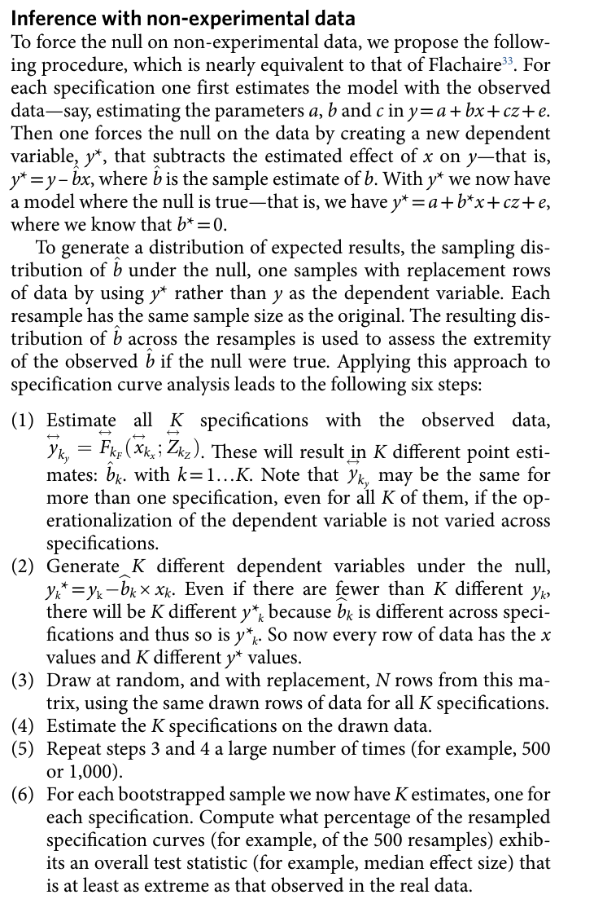

```{r setup, include=FALSE}
knitr::opts_chunk$set(
  collapse = TRUE,
  comment = "#>",
  #fig.path = "man/figures/README-",
  out.width = "100%",
  fig.retina = 2
)
```

In their paper, Simonsohn et al. (2020) propose a third step, which represent "inference with specification curve analysis. Here, we try to answer the following question: "considering the full set of reasonable specifications jointly, how inconsistent are the results with the null hypothesis of no effect?" (p. 1212). We have been thinking a lot about implementing this "third" step in this package. Until now, we have been concluding that there is still too much uncertainty about when such joint inferences make sense (see e.g., the very recent discussion by Del Giudice & Gangestad, 2021 of differences between truly arbitrary and non-arbitrary decision and the limits of multiverse analyses: https://journals.sagepub.com/doi/full/10.1177/2515245920954925). To quote some of these concerns:

>By inflating the size of the analysis space, the combinatorial explosion of unjustified specifications may, ironically, exaggerate the perceived exhaustiveness and authoritativeness of the multiverse while greatly reducing the informative fraction of the multiverse. At the same time, the size of the specification space can make it harder to inspect the results for potentially relevant findings. If unchecked, multiverse-style analyses can generate analytic “black holes”: massive analyses that swallow true effects of interest but, because of their perceived exhaustiveness and sheer size, trap whatever information is present in impenetrable displays and summaries.

We were (and still are) a bit concerned that tools for such an inference test could lead to misuse or wrongly conducted robustness test. Due to frequent questions, we nonetheless now integrated a function called `boot_null()` in the newest development version of `specr`. For details on the procedure, please have a look at the paper. Please note that the implemented procedure refers to the section "Inference with non-experimental data" in the paper. 

# Preparations


## Loading packages and data

```{r, message=F, warning = F}
# Load packages
library(specr)
library(tidyverse)
```


For this tutorial, we will simple use the data set included in the package, which we can call using `example_data`. 

```{r}
glimpse(example_data)
```


## Creating a custom function to extract full model

To prepare the inference under-the-null bootstrapping procedure, we need to run the standard specification curve analysis, but make sure that we keep the entire model object. By default, the function specr only keeps the relevant coefficient, but by creating a customized fitting function, we can add a colum e.g., `res` that contains the full model. 


```{r}
# Requires to keep full model
tidy_full <- function(x) {
  fit <- broom::tidy(x, conf.int = TRUE)
  fit$res <- list(x)  # Store model object
  return(fit)
}
```


## Setup specifications

When setting up the specifications, we simply pass the customized function via the argument `fun1`. 

```{r}
specs <- setup(data = example_data,
   y = c("y1", "y2"),
   x = c("x1", "x2"),
   model = "lm",
   controls = c("c1", "c2"),
   fun1 = tidy_full)          # Important to use the custom function here!
```


## Run standard specification curve analysis

Next, we simply ran the standard specification curve analysis using the core function `specr`. 

```{r}
results <- specr(specs)
summary(results)
```

So far, nothing new in this tutorial. 

# Refit the models under-the-null

The idea behind this inference approach is that one forces the null on the data. Have a look at the following section of the Simonsohn et al. (2020) paper (p. 1213):


```{r, out.width="50%", echo = F}

```

## Run bootstrap sampling procedure

To run this procedure, we simply use the function `boot_null()`, which requires the results, the specification setup, and the number of samples that should be drawn (Simonsohn et al. suggest n_samples = 500, here I am only demonstrating it with 10 resamples). 

```{r}
set.seed(42)
boot_models <- boot_null(results, specs, n_samples = 10) # better 1,000!
boot_models
```

The resulting fit object includes all resamples under the null (the output shows the first 6 curves summarized). 

## Summarize findings

Based on these resamples, we can compute several test statistics. Simonsohn et al. propose three, but here, we implemented the first two:

1. Obtaining the median effect estimated across all specifications, and then testing whether this median estimated
effect is more extreme than would be expected if all specifications had a true effect of zero.

2. The share of specifications that obtain a statistically significant effect in the predicted direction,
testing whether such share is more extreme (higher) than would be expected if all specifications had an effect of zero. 

These test statistics can be obtained by simply using the generic function `summary()` around the fitted bootstrap object:

```{r}
summary(boot_models)
```

As we can see here, first, the likelihood of obtaining a median of 0.14 under the assumption that all specifications had a true effect of zero is very low (p < .001). Furthermore, 8 out of 16 specifications are actually in the right direction and the likelihood of this share of specifications that obtains a statistically significant effect in the predicted direction (here: positive) to be obtained if the true effect was zero is again low (p < .001).  

## Plot inference curve

Simonsohn et al. also suggest that the observed specification curve can be plotted against the expected under-the-null specification curves. The expected curves are in this case based on the 10 resamples under-the-null. The curve show here the 2.5th (low), the 50th (mid) and the 97.5th percentiles of these resamples. 

```{r, fig.width=9, fig.height = 7, warning = F}
plot(boot_models)
```


# References

- Simonsohn, U., Simmons, J.P. & Nelson, L.D. (2020). Specification curve analysis. Nature Human Behaviour, 4, 1208–1214. https://doi.org/10.1038/s41562-020-0912-z
